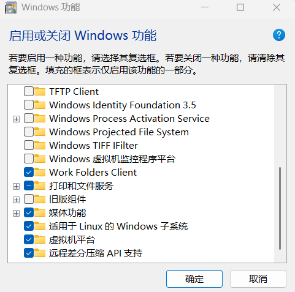
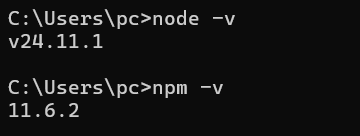
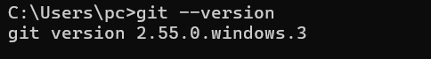
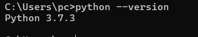
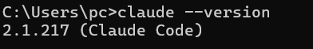
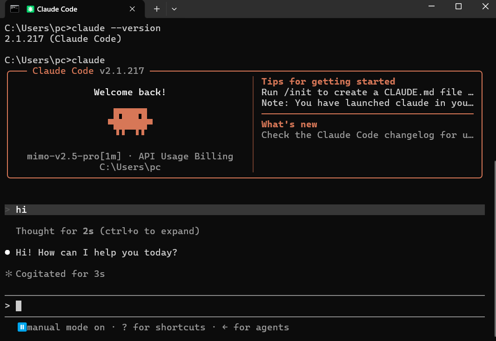

# 安装指南（Windows 实测）

> 本指南基于 B 站视频教程，以 Windows 11 实测为主。每一步建议截图存档。

## 环境信息

| 项目 | 版本 |
|------|------|
| 操作系统 | Windows 11 |
| Node.js | v24.11.1 |
| npm | 11.6.2 |
| Git | 2.55.0.windows.3 |
| Python | 3.7.3 |
| Claude Code | 2.1.217 |
| claude-code-router | 未采用（本机原生编译失败，见踩坑记录） |

---

## 前置准备：启用 WSL（可选，部分 Agent 工具需要）

如果你的 Windows 环境需要运行 Linux 子系统（部分 Agent 工具或容器依赖它），请先启用 WSL：

1. 按 `Win + R`，输入 `optionalfeatures` 回车，打开「启用或关闭 Windows 功能」
2. 勾选以下两项：
   - **适用于 Linux 的 Windows 子系统**
   - **虚拟机平台**
3. 点击「确定」，按提示重启电脑



> 完成后可在 PowerShell 中运行 `wsl --install -d Ubuntu` 安装 Ubuntu 子系统。

---

## 第一步：安装 Node.js

1. 打开 https://nodejs.org/zh-cn/download
2. 下载 Windows 版 **LTS** `.msi` 安装包（64-bit）
3. 双击安装，一路 Next
4. 关闭并重新打开终端（PowerShell），验证：

```powershell
node -v
npm -v
```

验证结果：



> 截图：显示版本号即为成功。

### ⚠️ 常见问题：PowerShell 禁止运行脚本

若 `npm -v` 报错 `无法加载文件 ... 因为在此系统上禁止运行脚本`：

```powershell
Set-ExecutionPolicy -Scope CurrentUser -ExecutionPolicy RemoteSigned
```

输入 `Y` 回车确认，再次运行 `npm -v`。

---

## 第二步：配置 npm 国内镜像

npm 默认从国外服务器下载，国内很慢。切换到淘宝镜像：

```powershell
npm config set registry https://registry.npmmirror.com/
npm config get registry
```

> 看到 `https://registry.npmmirror.com/` 即配置成功。

---

## 第三步：安装 Git

1. 从清华镜像下载（国内快）：https://mirrors.tuna.tsinghua.edu.cn/github-release/git-for-windows/git/
2. 下载 `Git-2.xx.x-64-bit.exe`，双击安装
3. 安装时注意勾选 **Git Bash Here** 和 **Add to PATH**
4. 重新打开终端验证：

```powershell
git --version
```

验证结果：



---

## 第四步：安装 Python（部分 Agent 工具需要）

某些 Agent 工具或 Python 项目依赖 Python 环境。Windows 上推荐使用 Python 官网安装包：

1. 打开 https://www.python.org/downloads/
2. 下载 Windows installer (64-bit)
3. 安装时勾选 **Add python.exe to PATH**
4. 重新打开终端验证：

```powershell
python --version
```

验证结果：



> 如需隔离项目依赖，可创建虚拟环境：`python -m venv .venv`

---

## 第五步：安装 Claude Code

```powershell
npm install -g @anthropic-ai/claude-code
claude --version
```

验证结果：



> 若提示 `claude 不是内部命令`：关闭终端重开；仍不行则检查 `%USERPROFILE%\.local\bin` 是否在 PATH 中。

**本机实测：直接运行 `claude` 即可使用。** 输入 `claude` 成功启动并进入对话界面（见下图），顶部显示 `mimo-v2.5-pro[1m]` 与 `API Usage Billing`，已能正常对话。



> 实测中直接运行 `claude` 后，本机默认使用 `mimo-v2.5-pro` 模型并已能正常对话。CCR 备选路线在本机因原生编译失败未能安装，详见[踩坑记录](troubleshooting.md)。

---

## 第六步：安装 VS Code（可选但推荐）

1. 下载：https://code.visualstudio.com
2. 安装时勾选「添加到 PATH」
3. 后续在 VS Code 内置终端中运行 `claude` 体验更好

---

## 验证安装完成

到此，以下命令都应能正常显示版本号：

```powershell
node -v
npm -v
git --version
python --version
claude --version
```

下一步 → [模型接入（可选 CCR 备选方案）](model-setup.md)
